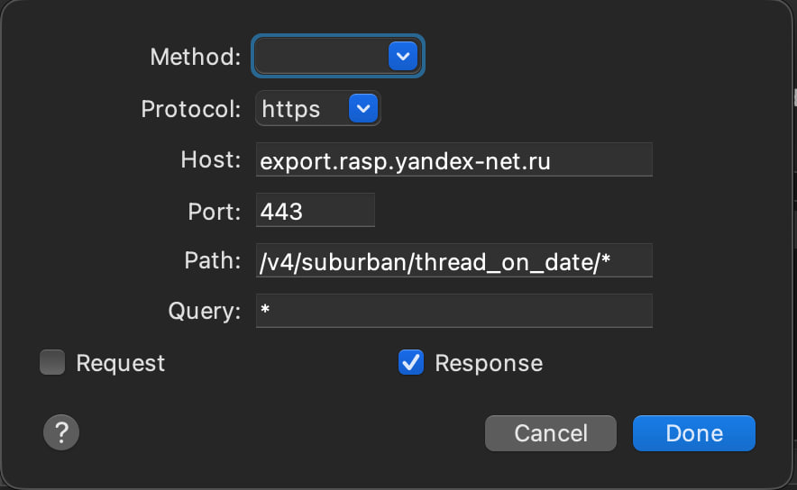
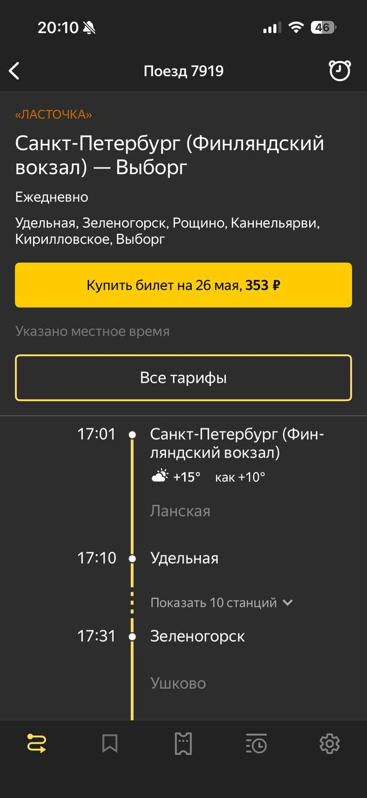
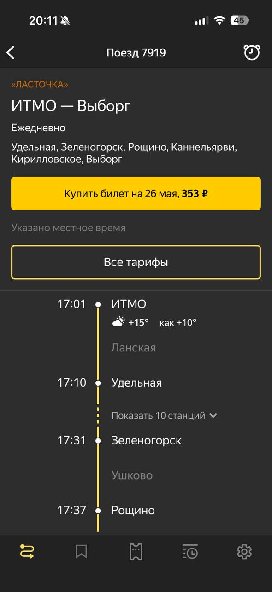
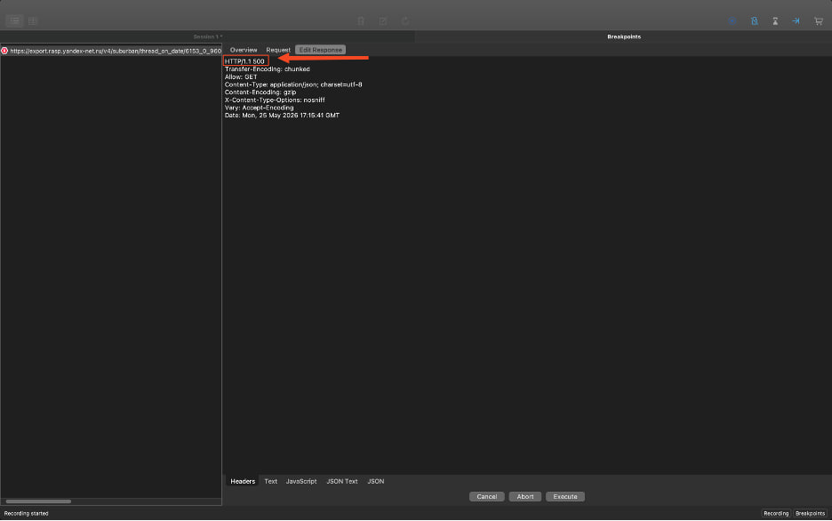
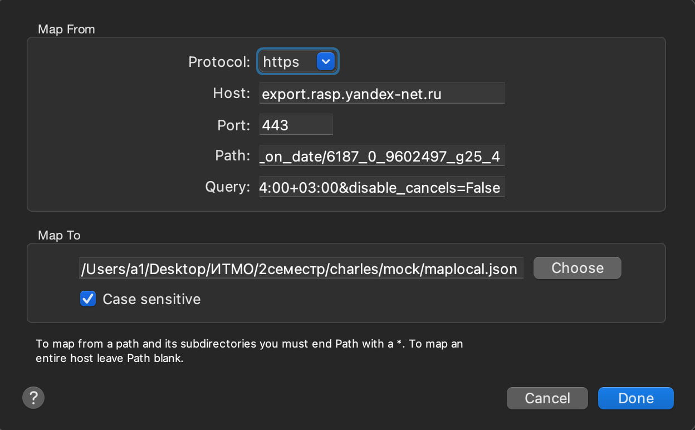
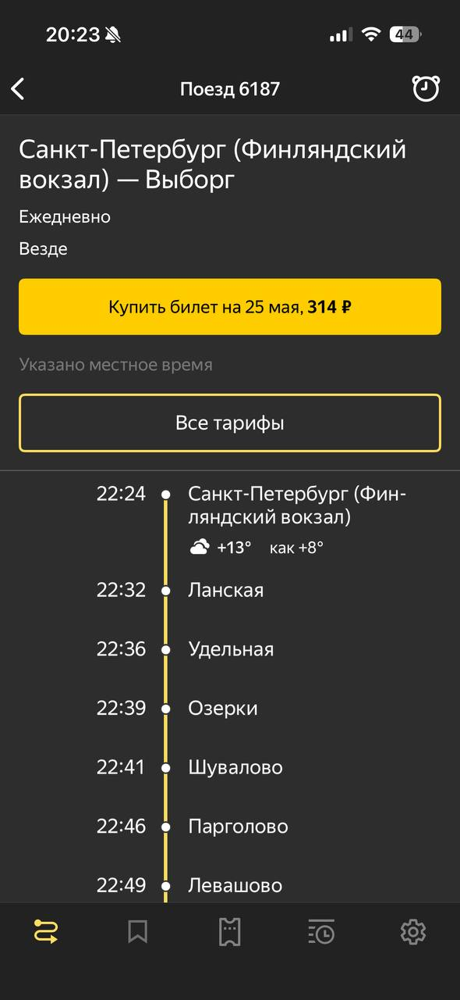
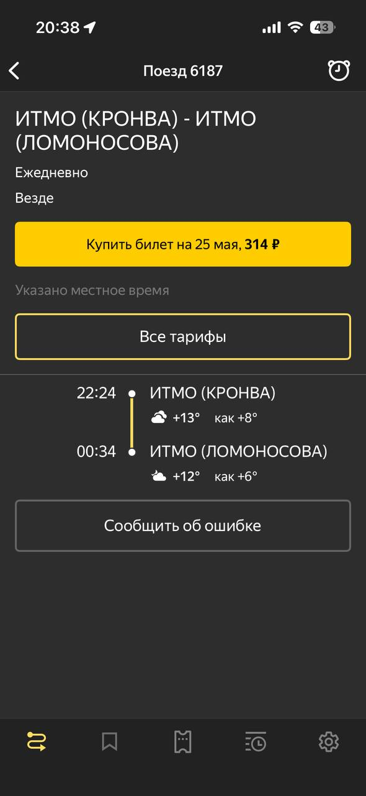

# Задание по Charles
**Выполнил**: Некрасов Богдан<br>
**Группа**: Р4150<br>
**ПО**: Charles Proxy v5.0.3
**Приложение**: Я.Электрички (Mobile)

## Breakpoints
Перехватываем запрос на открытие конкретного билета Санкт-Петербург - Выборг

Находим заброс в сетке запросов.

Настраиваем breakpoint правило:


- Подменять будем точку отправления.

**До подмены ответа**:


**Результат после подмены ответа**:


- **Сымитируем 500 ошибку**:



**Результат**:


## Map Local

Подменяем выдачу подробностей билета Санкт-Петербург - Выборг

Приложение выдало JSON:
```json
{
	"canonical_uid": "R_6187_9602497_g25_4",
	"title": "Санкт-Петербург (Финляндский вокзал) — Выборг",
	"number": "6187",
	"is_combined": false,
	"start_time": "2026-05-25T22:24:00+03:00",
	"start_time_msk": "2026-05-25T22:24:00+03:00",
	"stops": "везде",
	"days": "ежедневно",
	"stations": [{
		"title": "Санкт-Петербург (Финляндский вокзал)",
		"is_combined": false,
		"popular_title": "Финляндский вокзал",
		"esr": "038205",
		"departure": 0,
		"departure_local": "2026-05-25T22:24:00+03:00",
		"state": {
			"key": "6187__9602497___2026-05-25T22:24:00___9602497___None___0___None___None"
		}
	}, {
		"title": "Ланская",
		"is_combined": false,
		"esr": "038215",
		"arrival": 7,
		"arrival_local": "2026-05-25T22:31:00+03:00",
		"departure": 8,
		"departure_local": "2026-05-25T22:32:00+03:00",
		"state": {
			"key": "6187__9602497___2026-05-25T22:24:00___9603444___7___8___None___None"
		}
	}
........

	"tariffs": [{
		"price": {
			"currency": "RUR",
			"value": 314.0
........

	"tariff": {
		"currency": "RUR",
		"value": 314.0
	}
```

- Создадим наш JSON, которым мы будем подменять выдачу (полный JSON в `/mock/maplocal.json`):
```json
{
	"canonical_uid": "R_6187_9602497_g25_4",
	"title": "ИТМО (КРОНВА) - ИТМО (ЛОМОНОСОВА)",
	"number": "1111",
	"is_combined": false,
	"start_time": "2026-05-25T22:24:00+03:00",
	"start_time_msk": "2026-05-25T22:24:00+03:00",
	"stops": "везде",
	"days": "ежедневно",
	"stations": [{
		"title": "ИТМО (КРОНВА)",
		"is_combined": false,
		"popular_title": "ИТМО (КРОНВА)",
		"esr": "038205",
		"departure": 0,
		"departure_local": "2026-05-25T22:24:00+03:00",
		"state": {
			"key": "6187__9602497___2026-05-25T22:24:00___9602497___None___0___None___None"
		}
	}, {
		"title": "ИТМО (ЛОМОНОСОВА)",
		"is_combined": false,
		"popular_title": "ИТМО (ЛОМОНОСОВА)",
		"esr": "020004",
		"arrival": 130,
		"arrival_local": "2026-05-26T00:34:00+03:00",
		"state": {
			"key": "6187__9602497___2026-05-25T22:24:00___9603175___130___None___None___None"
		}
	}],
	"tariffs": [{
		"price": {
			"currency": "RUR",
			"value": 85.0
........
	"tariff": {
		"currency": "RUR",
		"value": 85.0
	}
}
```

- Настраиваем правило Map Local:


### Выдача ДО подмены JSON:


### Выдача ПОСЛЕ подмены JSON:



## Ответы на вопросы

### Почему возможен перехват трафика

Перехват возможен, потому что мобильное приложение отправляет запросы на сервер через сеть, а Charles становится “посредником” между приложением и сервером.

То есть схема такая:

`мобильное приложение → Charles → сервер`

Для HTTPS-трафика данные зашифрованы, но Charles может расшифровывать их, при помощи установленного и доверенного сертификата Charles. В этом случае приложение считает Charles доверенным участником соединения.

### Метод перехвата трафика

Используется метод MITM — Man-in-the-Middle.

Суть метода:

1. Charles принимает запросы от приложения.
2. Затем Charles сам отправляет эти запросы на сервер.
3. Ответ от сервера Charles получает обратно и показывает в интерфейсе.
4. Потом Charles передает ответ приложению.

Для HTTPS дополнительно используется подмена сертификата: Charles выдает приложению свой сертификат, а сам устанавливает защищенное соединение с настоящим сервером.